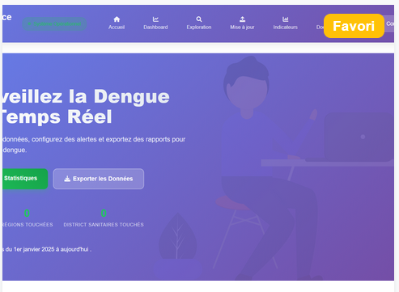

## Data Analyst | Passionné par la data | En recherche d'opportunités

  <!-- si tu as une photo professionnelle, mets-la ici -->

Bienvenue sur mon portfolio !  
Je suis **diplômé en Data Analyst**, basé au Burkina Faso, à la recherche d’un premier poste pour mettre mes compétences au service de projets concrets. Passionné par l’analyse de données et la visualisation, j’aime transformer des données brutes en informations utiles à la prise de décision.

---

## 🎓 Formation

**Master en Data Science / Data Analyst** (ou équivalent)  
*[Nom de ton université/école]* – [Ville, Pays]  
*[Année de début] – [Année de fin]*  
Mémoire : *[Titre de ton mémoire]* (optionnel)

**Licence en [Mathématiques/Informatique/Économie]**  
*[Nom de l’université]* – [Ville, Pays]  
*[Année de début] – [Année de fin]*

---

## 🛠 Compétences techniques

- **Langages** : Python (Pandas, NumPy, Scikit-learn), R, SQL, VBA
- **Visualisation** : Matplotlib, Seaborn, Plotly, Streamlit, Power BI (ou Tableau)
- **Bases de données** : PostgreSQL, MySQL, SQLite
- **Outils** : Git, GitHub, Jupyter Notebook, Excel avancé
- **Méthodes** : Statistiques descriptives, tests d’hypothèses, régressions, clustering, séries temporelles

---

## Projets réalisés

### Analyse des cas de dengue au Burkina Faso  
*Projet académique*  

**Objectif** : Étudier l’évolution des cas de dengue par région et identifier les périodes à risque.  

**Aperçu du projet**

*Avan de commencer, je tiens à préciser que ce projet a été réalisé pour l'obtention de mon certificat de Data Analyst à SIMPLON-BF. Par ailleurs le Jury a apprécié le projet ce qui lui a valut la note de 38/40.* 
Ce projet a eu lieu grâce au Mentoring de Mr Ousmane OUEDRAOGO. *Le Dengue Surveillance & Alert System* est une plateforme technologique complète que j'ai conçue et développée pour renforcer les capacités de surveillance épidémiologique de la dengue au Burkina Faso. Cette solution intègre une *API REST performante*, une interface web intuitive et un système intelligent d'alerte précoce, formant un écosystème cohérent avec le package Python dengsurvap-bf. Face à la recrudescence des épidémies de dengue en Afrique de l'Ouest et aux limitations des systèmes de surveillance traditionnels, cette plateforme répond au besoin critique d'un outil de monitoring en temps réel, capable de détecter précocement les signaux épidémiques et de supporter la prise de décision en santé publique. 
Architecture Technique Complète : 
* Backend API : FastAPI avec documentation Swagger/OpenAPI intégrée 
* Base de Données : Modèle relationnel avec SQLAlchemy ORM et Postgrès
* Frontend : Interface responsive avec Bootstrap et JavaScript vanilla 
* Système d'Alerte : Moteur de règles configurable avec planification automatique 
* Gestion des Données : Pipeline ETL pour l'import/export et le nettoyage 
* Sécurité : Authentification et validation des données avec Pydantic 

  

**Code source** : [GitHub](https://github.com/yamsaid/DenGueSurveillanceApi)
**Demo** : [web](https://web-production-7a08.up.railway.app/)

---

### Projet QGIS - Cartographie Sanitaire et Démographique : Analyse Spatiale de la mortalité néo-natale  
*projet academique*  

La mortalité néo-natale au Burkina Faso est un problème de santé publique complexe, influencé par des facteurs multiples et interdépendants. Malgré les efforts déployés pour améliorer les services de santé maternelle et infantile, des disparités géographiques persistent, avec des taux de mortalité plus élevés dans certaines régions. Ces disparités soulèvent plusieurs questions :

*Quelles sont les zones géographiques les plus touchées par la mortalité néo-natale au Burkina Faso ?*
*Quels sont les facteurs socio-économiques, sanitaires et environnementaux qui contribuent à ces disparités spatiales ?*
*Comment les systèmes d'information géographique peuvent-ils aider à identifier les zones prioritaires pour des interventions ciblées ?*
*Quelles stratégies peuvent être mises en place pour réduire la mortalité néo-natale dans les zones à haut risque ?*

En répondant à ces questions, ce projet vise à fournir une analyse approfondie des dimensions spatiales de la mortalité néo-natale au Burkina Faso, tout en proposant des solutions concrètes pour améliorer la santé des nouveau-nés et réduire les inégalités géographiques

  
**Code source** : [GitHub](https://github.com/yamsaid/projets-academiques/blob/main/QGIS/README.md)

---

## 💼 Expériences

**Stage Data Analyst**  
*[Nom entreprise/organisation]* – [Ville] | [Mois Année] – [Mois Année]  
- Participation à la mise en place d’un système de reporting automatisé (Excel + VBA).
- Analyse des données de satisfaction client et présentation des résultats à l’équipe.
- Contribution à la rédaction d’un tableau de bord Power BI.

**Projet tutoré**  
*[Nom organisation]* – [Ville] | [Mois Année] – [Mois Année]  
- Réalisation d’une étude de marché à partir de données secondaires.
- Utilisation de Python pour le nettoyage et l’analyse statistique.
- Recommandations finales présentées devant un jury.

---

## Centres d’intérêt

- **Lecture** : essais sur la data, développement personnel, romans.
- **Code** : contribution à des projets open source, veille technologique.
- **Sport** : course à pied, football – pour garder l’équilibre et la persévérance.

---

## 📬 Contact

Je suis actuellement à la recherche d’un premier poste en tant que **Data Analyst** (stage ou CDD/CDI). N’hésitez pas à me contacter !

**Email** : [ton.email@example.com](mailto:ton.email@example.com)  
**GitHub** : [https://github.com/ton-compte](https://github.com/ton-compte)  
**LinkedIn** : [https://linkedin.com/in/ton-profil](https://linkedin.com/in/ton-profil)

---